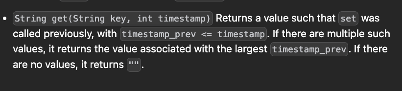

[Time Based Key-Value Store - LeetCode](https://leetcode.com/problems/time-based-key-value-store/description/)


```cpp
class TimeMap {
public:
    TimeMap() {
        
    }
    
    void set(string key, string value, int timestamp) {
        
    }
    
    string get(string key, int timestamp) {
        
    }
};
```




```cpp
class TimeMap {
    unordered_map<string,map<int,string>> m;
public:
    TimeMap() {
        
    }
    
    void set(string key, string value, int timeStamp) {
        m[key][timeStamp]=value;
    }
    
    string get(string key, int timeStamp) {
        if(!m.count(key)) return "";
        if(m[key].count(timeStamp)) return m[key][timeStamp];
        auto it=m[key].upper_bound(timeStamp);
        if(it==m[key].begin()){
            return "";
        }
        it--;
        return it->second;
    }
};

```