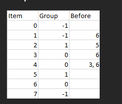

[Sort Items by Groups Respecting Dependencies - LeetCode](https://leetcode.com/problems/sort-items-by-groups-respecting-dependencies/)

```
//group[i] is the group that the i-th item belongs to and it's equal to -1 if the i-th item belongs to no group.     
//A group can have no item belonging to it

//The items that belong to the same group are next to each other in the sorted list.
```

```cpp
vector<int> sortItems(int noOfItems, int noOfGroups, vector<int>& group, vector<vector<int>>& beforeItems)
```



