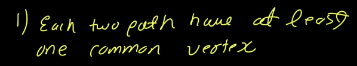
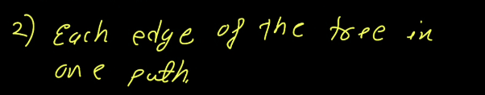
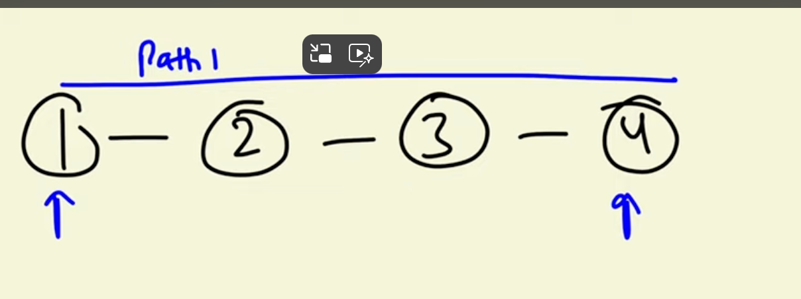
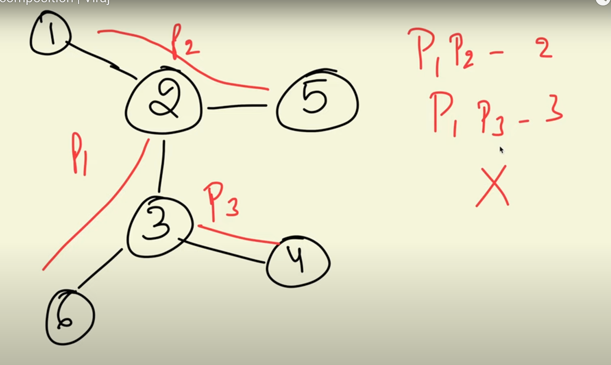
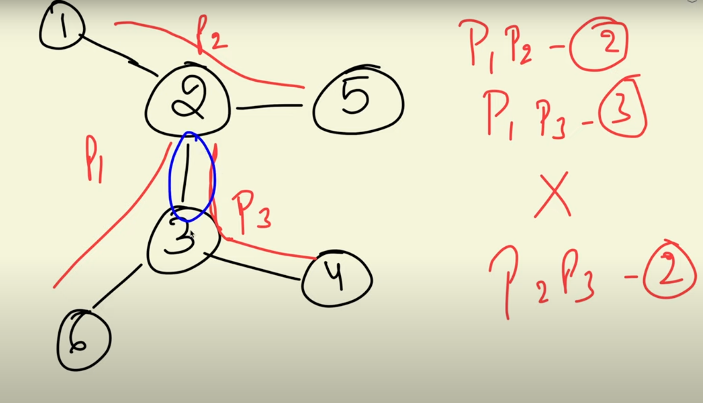
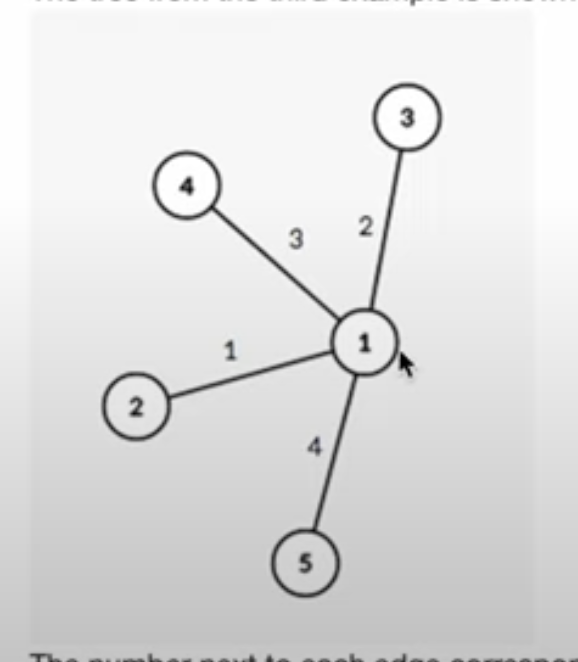
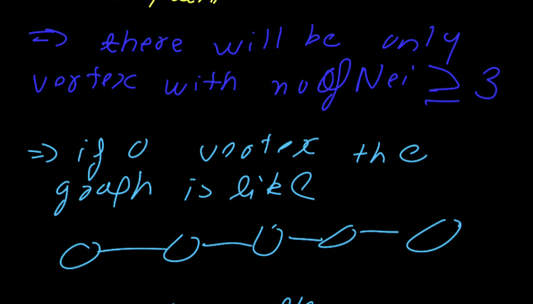
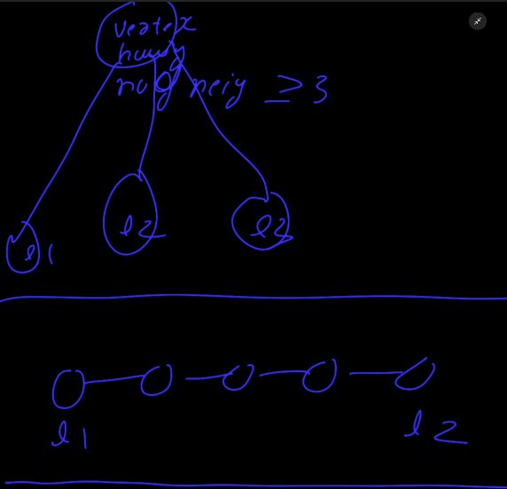

[Problem - 981C - Codeforces](https://codeforces.com/problemset/problem/981/C)

[Useful Decomposition | Viraj - YouTube](https://youtu.be/PnMB-o9B0eM?si=jMwUgE11XnXJGxcM)







-----









----------






```cpp
void solve(){   
    iinp(n);
    vvl al(n,vl());
    for(ll i=1;i<n;i++){
        ll u,v;
        inp(u,v);
        u--,v--;
        al[u].push_back(v);
        al[v].push_back(u);
    }
    vl non(n);
    for(ll i=0;i<n;i++){
        non[i]=al[i].size();
    }
    ll root=-1,cnt=0;
    vl leaves;
    for(ll i=0;i<n;i++){
        if(non[i]>2){
            root=i;
            cnt++;
        }
        if(non[i]==1) leaves.push_back(i); 
    }
    if(cnt>1){
        pri("No");
        return;
    }
    pri("Yes");
    if(cnt==0){
      pri(1);
      pri(leaves.front()+1,leaves.back()+1);
      return ;
    }

    pri(leaves.size());
    for(ll i=0;i<leaves.size();i++){
        pri(root+1,leaves[i]+1);
    }
    pri();

}
```

