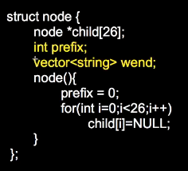
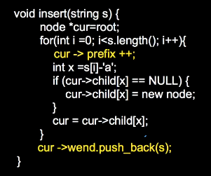
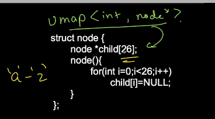
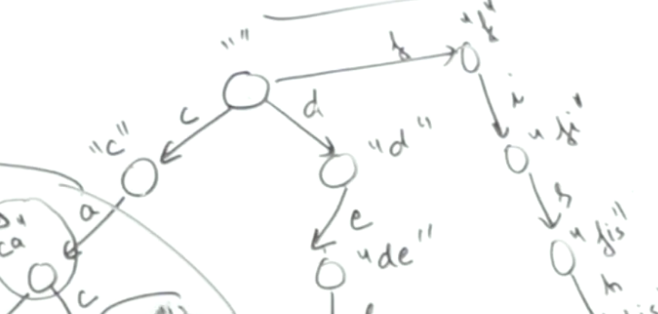

ppa project
AZ
Priyansh
[Trie - LeetCode](https://leetcode.com/tag/trie/)
50 problems on leetcode

--------------------------------


*************************
Problem solving



---------------------------------
reTRIEval
A [**trie**](https://en.wikipedia.org/wiki/Trie) (pronounced as "try") or **prefix tree** is a tree data structure used to efficiently store and retrieve keys in a dataset of strings. There are various applications of this data structure, such as 
1. autocomplete 
2. spellchecker.
3. Search ahead PPA

The root node have no data


the edge represents the char, the root have no char and have a index of 0

[Code 360 by Coding Ninjas](https://www.naukri.com/code360/problems/implement-trie_1387095?utm_source=youtube&utm_medium=affiliate&utm_campaign=striver_tries_videos&leftPanelTabValue=PROBLEM)


```cpp
#include <bits/stdc++.h> 
using namespace std;

class Trie{
    private:
        struct TrieNode{
            TrieNode* children[26];
            int noOfTimesPresent;
            int strings; 

            TrieNode(){
                noOfTimesPresent = 0;
                strings = 0;
                for(int i = 0; i < 26; i++) {
                    children[i] = nullptr;
                }
            }
        };

        TrieNode* root=nullptr;


    void deleteTrie(TrieNode* node) {
        if (node) {
            for (int i = 0; i < 26; i++) {
                deleteTrie(node->children[i]);
            }
            delete node;
        }
    }


    public:

    Trie(){
        root = new TrieNode();
    }

    ~Trie() {
        deleteTrie(root);
        // delete root;
    }
/*******************************************************************************************/

    void insertUtil(TrieNode* node, string &word, int idx){
        node->strings++;
        if(idx==word.size()){
            node->noOfTimesPresent++;
            return;
        }
        int childIdx=word[idx]-'a';
        if(!node->children[childIdx]){
            node->children[childIdx]= new TrieNode();;
        }
        node=node->children[childIdx];        
        insertUtil(node,word,idx+1);   
    }

    void insert(string &word){
        insertUtil(root,word,0);
    }

/*******************************************************************************************/

    int searchUtil(string &word, int idx, TrieNode* node){
        if(!node) return 0;
        if(idx==word.size()) return node->noOfTimesPresent;
        return searchUtil(word,idx+1,node->children[word[idx]-'a']);
    }

    int search(string word) {
        return searchUtil(word,0,root);
    }

/*******************************************************************************************/


    int startsWithUtil(string &prefix, int idx, TrieNode* node){
        if(!node) return 0;
        if(idx==prefix.size()) return node->strings;
        return startsWithUtil(prefix,idx+1,node->children[prefix[idx]-'a']);
    }

    int startsWith(string prefix) {
        return startsWithUtil(prefix,0,root);
    }


/*******************************************************************************************/

    void eraseUtil(string &word, int idx, TrieNode* node){
        node->strings--;
        if(idx==word.size()){
            node->noOfTimesPresent--;
            return;
        }
        eraseUtil(word,idx+1,node->children[word[idx]-'a']);
    }


    void erase(string &word){
        if(search(word)){
            eraseUtil(word,0,root);
        }
    }

/*******************************************************************************************/

};

int main(){
    Trie trie1= Trie();
    Trie* trie2=new Trie();
}
```


