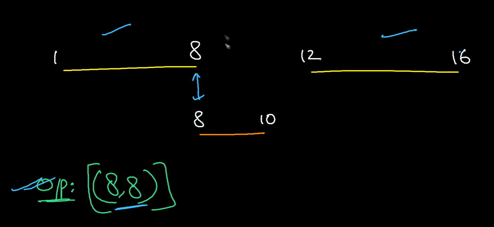

[Just a moment...](https://leetcode.com/problems/interval-list-intersections/editorial/)




[youtu.be](https://youtu.be/Qh8ZjL1RpLI?si=hmOi1E8tnE1USw_J)

```cpp
bool f(vector<int> &v1, vector<int> &v2){
    return min(v1[1],v2[1])>=max(v1[0],v2[0]);
}


vector<vector<int>> intervalIntersection(vector<vector<int>>& v1, vector<vector<int>>& v2) {
    vector<vector<int>> ans;
    int n1=v1.size(),n2=v2.size();
    int i=0,j=0;
    while(i<n1 and j<n2){
        if(f(v1[i],v2[j])) ans.push_back({max(v1[i][0],v2[j][0]),min(v1[i][1],v2[j][1])});
        if(v1[i][1]<v2[j][1]) i++;
        else j++;
    }
    return ans;
    
}
```
