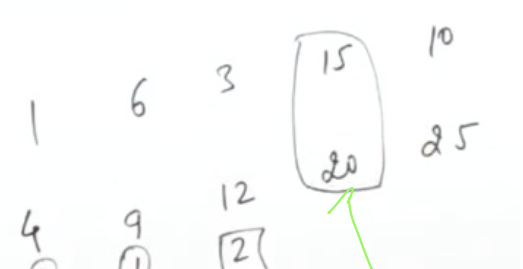

Provide it to the person which is finishing the job late

```cpp
sort(it(ma),cmp);
int et1=0,et2=0;
int ans=0;
for(int i=0;i<n;i++){
    //this work can be done by both the person
    //starting time of the work is more then the ending time of current job
    if(v[i][0]>=et1 and v[i][0]>=et2){
      int maxx=max(et1,et2);
      //give it to to the person having higher end time
      if(maxx==et1) et1=v[i][1];
      else et2=v[i];
      ans++;
    }
    else if(v[i][0]>=e1){
      et1=v[i][1];
      ans++;
    }
    else if(v[i][0]>=e2){
      et2=v[i][1];
      ans++;
    }
  }

```
