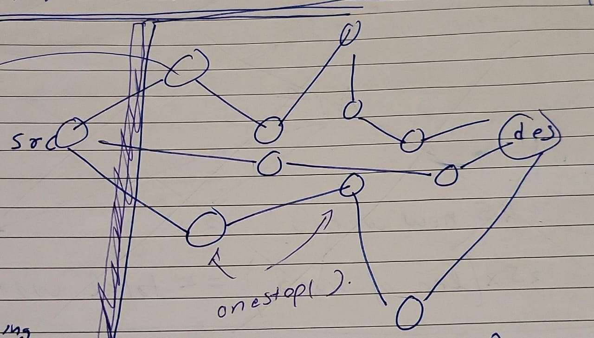

[leetcode.com](https://leetcode.com/problems/word-ladder/)
1. End word need not to be in word list



```cpp
class Solution {
public:
    int ladderLength(string beginWord, string endWord, vector<string>& wordList) {
        unordered_set<string> words(wordList.begin(),wordList.end());
        unordered_map<string,bool> visited;
        queue<pair<string,int>> q;
        if(!words.count(endWord)) return 0;
        visited[beginWord]=1;
        q.push({beginWord,0});
        while(!q.empty()){
            pair<string,int> x=q.front();q.pop();
            string tmp=x.first;
            if(tmp==endWord) return x.second+1;
            for(int i=0;i<tmp.size();i++){
                char ch=tmp[i];
                for(int j=0;j<26;j++){
                    char rep=j+'a';
                    tmp[i]=rep;
                    if(words.count(tmp) and !visited[tmp]){
                        visited[tmp]=1;
                        q.push({tmp,x.second+1});
                    }
                }
                tmp[i]=ch;
            }
        }
        return 0;
    }
};
`
