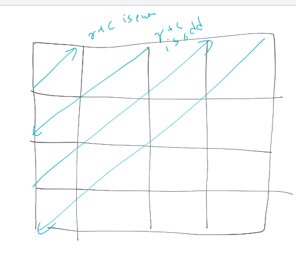

r+c is even then move upwards north east
r+c is odd south west




```cpp
while(cnt--){
  ans.pb(ma[r][c]);
  if(r+c is even){
    if(r==0) c++;
    else if(c==cc-1) r++;
    else r--,c++;
  }
  else{
    if(r==rr-1) c++;
    else if(c==0) r++;
    else r++,c--;
  }
}
```

