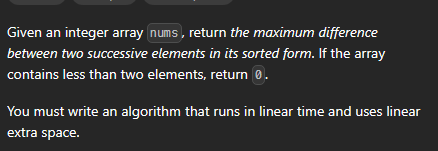
[Maximum Gap - LeetCode](https://leetcode.com/problems/maximum-gap/description/)
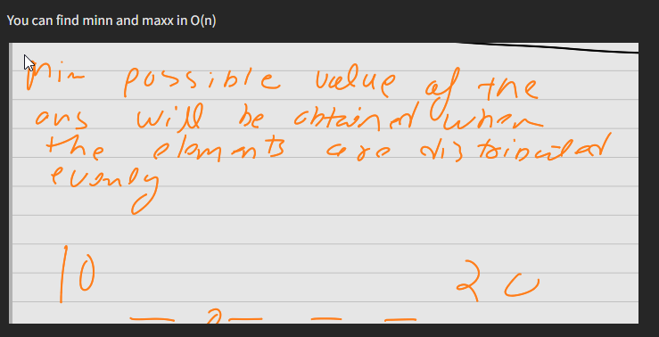
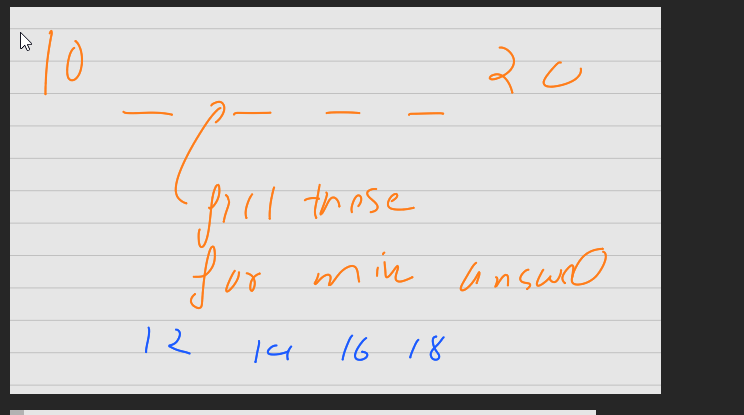
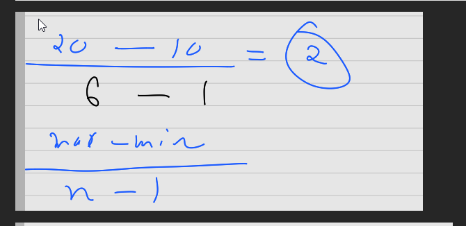
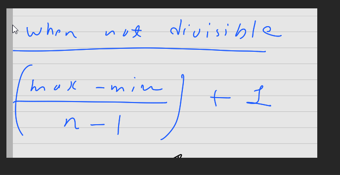

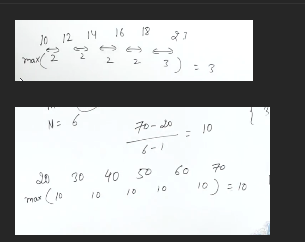

# Generating BUCKETS

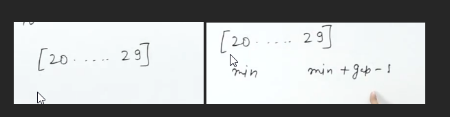

If there are elements in the array which belong to this range, those will not belong to the answer, because we proved the minimum answer is 10

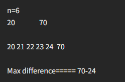

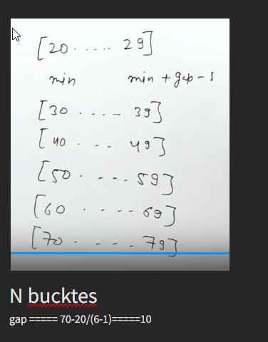

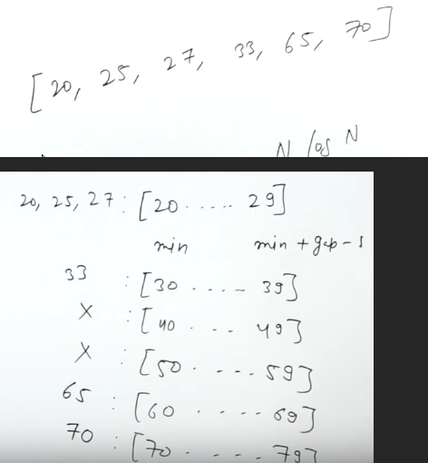

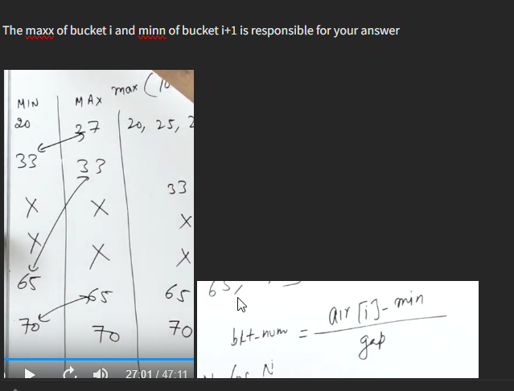

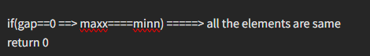


```cpp
 int n= v.size();
 if(n<2) return 0;

int minn=*min_element(it(v)), maxx=*max_element(it(v));
if(minn==maxx) return 0;

int gap=(maxx-minn)/(n-1);
if((maxx-minn)%(n-1)) gap++;

//the buckets 0 to n-1
vector<int> minArr(n,INT_MAX),maxArr(n,INT_MIN);


for(int x: v){
//Traversing all the elements and filling the minArr and maxArr
    int buckNo=(x-minn)/gap;
    minArr[buckNo]=min(minArr[buckNo],x);
    maxArr[buckNo]=max(maxArr[buckNo],x);
}
```


```CPP
int ans=INT_MIN, prev=INT_MIN;


//itirating over the n buckets
for(int i=0;i<n;i++){
    if(minArr[i]==INT_MAX) continue;
    //we dont have any anything inside our this bucket

    //if it comes to this region, it means the bucket
    //have some memebers
    
    if(prev==INT_MIN) prev=maxArr[i];
    //if we dont have a valid prev, then for the firstime 
    //for gaining a prev, then only the comparison start
  
    else{
        ans=max(ans,minArr[i]-prev);
        prev=maxArr[i];
    }
}
```
