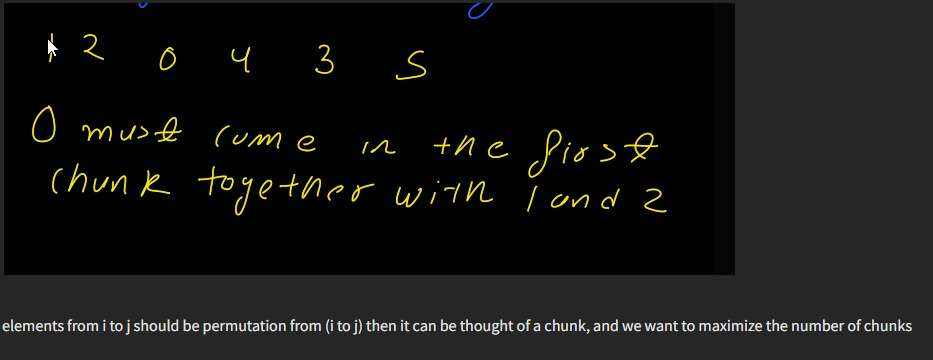
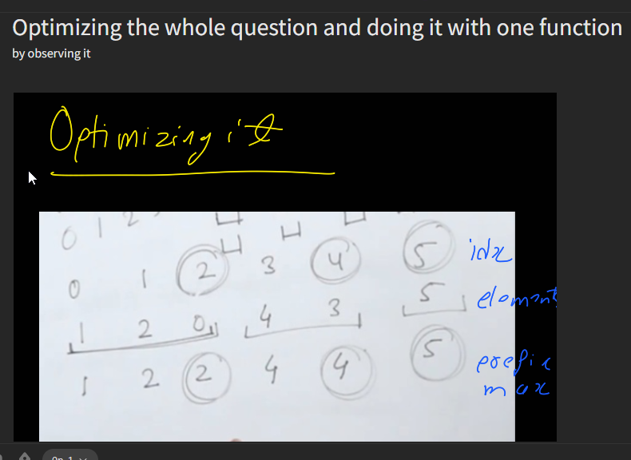

[Max Chunks To Make Sorted - LeetCode](https://leetcode.com/problems/max-chunks-to-make-sorted/)

0-----n-1
We  can split `arr` into some number of **chunks**
and individually sort each chunk.
  

After concatenating the chunks, the result should equal the sorted array.
  

Return *the largest number of chunks you can divide the arrays into*


1. *in the worst case, you can divide the array into one chunk only when the array is in decreasing order*
2. In the best case you can divide the array into n chunks when the array is sorted




# O(n^2)

```cpp
int maxChunksToSorted(vector<int>& v) { 
    int n=v.size(),ans=0; 
    int l=0,h=0; 
    while(h<n){ 
        if(canBeChunked(l,h,v)){ 
            ans++; 
            l=h+1; 
            h=l; 
        } 
        else h++; 
    } 
    return ans;         
} 
 
bool canBeChunked(int i,int j,vector<int>& v){ 
    for(int k=i;k<=j;k++){ 
        if(v[k]<i or v[k]>j) return 0; 
    } 
    return 1;         
}  
```





```cpp
int ans=0,cmax=INT_MIN,n=v.size();
for(int i=0;i<n;i++){
    cmax=max(cmax,v[i]);
    if(cmax==i) ans++;
}
```

