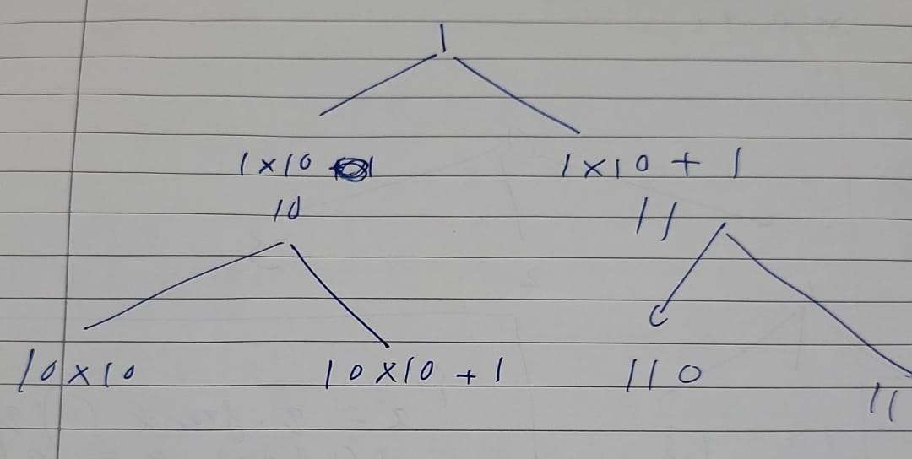

[Generate Binary Numbers | Practice | GeeksforGeeks ](https://practice.geeksforgeeks.org/problems/generate-binary-numbers-1587115620/1)


```cpp

vector<string> generate(int n){
    vector<string> ans;
    queue<long long> q;
    q.push(1ll);
    while(n--){
        long long x=q.front();q.pop();
        ans.push_back(to_string(x));
        q.push(x*10);
        q.push(x*10+1);
    }
    return ans;
}
```

