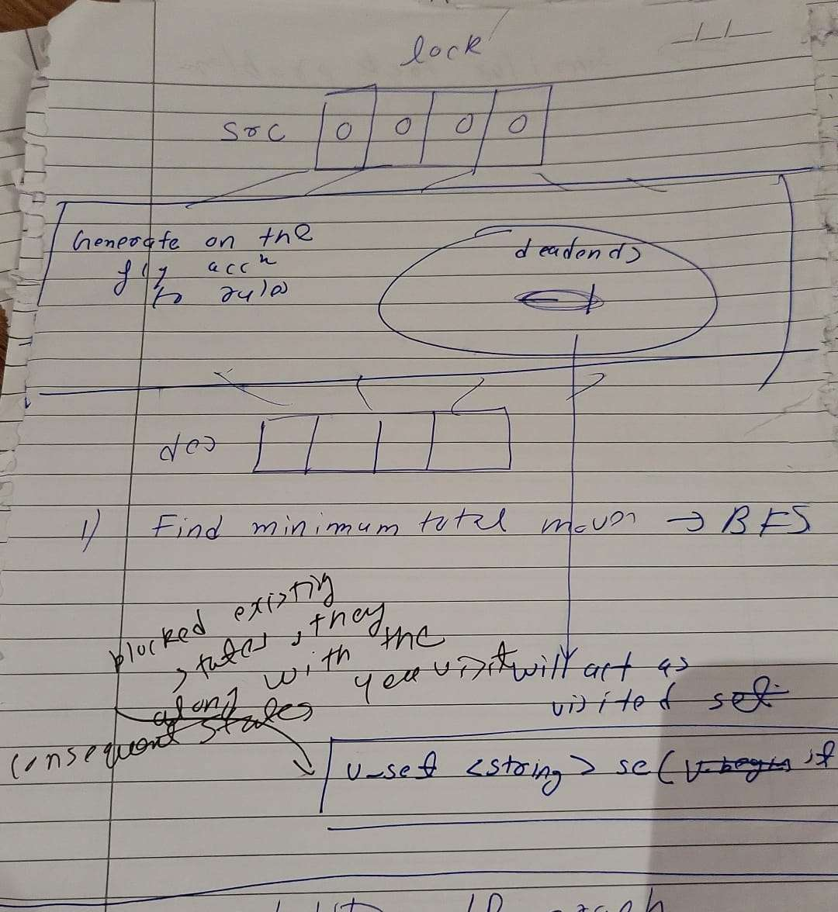

[leetcode.com](https://leetcode.com/problems/open-the-lock/description/)
1. Find min no of moves



```cpp
class Solution {
public:

    vector<string> getNei(string &s){
        vector<string> nei;
        for(int i=0;i<s.size();i++){
            char temp=s[i];
            int buff=s[i]-'0';
            char p1=(buff+1)%10 +'0';
            char m1=(buff-1+10)%10 + '0';
            s[i]=p1;
            nei.push_back(s);
            s[i]=m1;
            nei.push_back(s);
            s[i]=temp;
        }

        return nei;
    }

    int openLock(vector<string>& v, string k) {
        unordered_set<string> se(v.begin(),v.end());
        string src="0000";
        if(se.count(src) or se.count(k)) return -1;
        queue<pair<string,int>> q;
        q.push({src,0});
        while(!q.empty()){
            string temp=q.front().first;
            int steps=q.front().second;
            q.pop();
            if(temp==k) return steps;
            vector<string> nei=getNei(temp);
            for(int i=0;i<nei.size();i++){
                if(se.count(nei[i])!=0) continue;
                se.insert(nei[i]);
                q.push({nei[i],steps+1});
            }
        }
        return -1;

    }
};
```