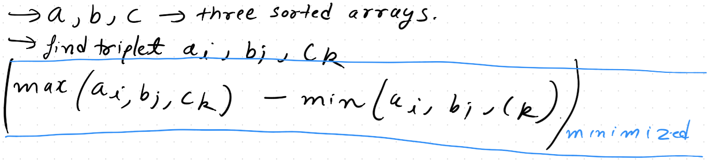

[Minimize the absolute difference | InterviewBit](https://www.interviewbit.com/problems/minimize-the-absolute-difference/)




since we cant decrese the maximum

```cpp
int ans=INT_MAX;
int i=0,j=0,k=0;
while(i<A.size() and j<B.size() and k<C.size()){
    int a=A[i],b=B[j], c=C[k];
    int minn=min({a,b,c}),maxx=max({a,b,c});
    ans=min(maxx-minn,ans);
    if(a==minn) i++;
    else if(b==minn) j++;
    else k++;
}
```
we stop whenever any of the pointer crosses the array boundary, it would has been the minimum among the theee, which is crossing. Now, moving the other two will just going to increase the maxima since your minima is fixed and stuck in the array end

