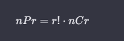
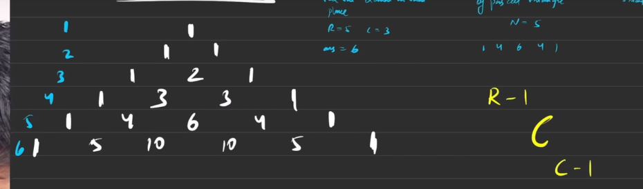
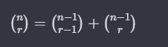
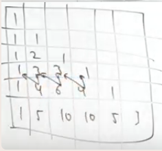
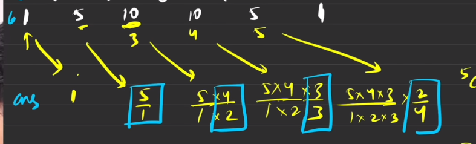
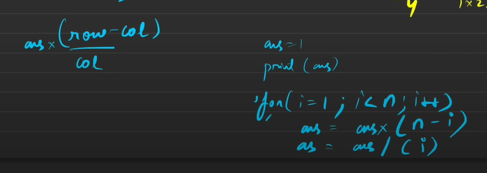

# Pascal triangle

1. do questions from ppa
2. do questions from tle 
\



The row has same number of colums as number of rows







[leetcode.com](https://leetcode.com/problems/pascals-triangle/solutions/)
This matrix will directly give you ncr, so to calculature ncr you need a matrix of size n+1 * r+1 

```cpp
vector<vector<int>> generate(int rr) {
    vector<vector<int>> ma(rr,vector<int>(rr));
    for(int r=0;r<rr;r++){
        ma[r].resize(r+1);
        ma[r][0]=ma[r][r]=1;
        for(int c=1;c<r;c++){
            ma[r][c]=ma[r-1][c-1]+ma[r-1][c];
        }
    }
    return ma;
}
```


# Do without without creating the initial matrix 
```cpp
vector<vector<int>> generate(int rr) {
    vector<vector<int>> ma;
    vector<int> tmp;
    ma.push_back({1});
    for(int r=1;r<rr;r++){
        tmp.push_back(1);
        for(int c=1;c<r;c++){
            tmp.push_back(ma[r-1][c-1]+ma[r-1][c]);
        }
        tmp.push_back(1);
        ma.push_back(tmp);
        tmp.clear();
    }
    return ma;
}
```

# Optimal IS for generting a row
 
 
 

# Getting rows efficiently
```cpp
vector<int> getRow(int rr) {
    rr++;
    vector<int> ans;
    ans.push_back(1);
    for(int c=1; c<rr;c++) ans.push_back(((long long)ans[c-1]*(rr-c))/c);
    return ans;
}
```

You could use this answer answer to generate the matrix in the same time complexity
