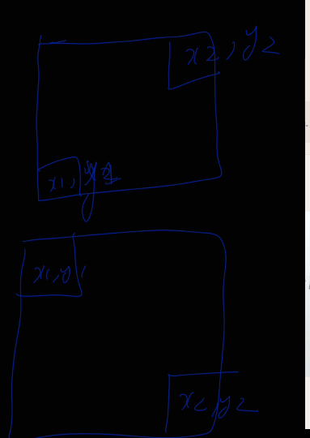

# Preprocessing



```
ps[i][j]=ma[i][j]
        + ps[i-1][j]
        + ps[i][j-1]
        - ps[i-1][j-1]
```


```cpp
void prefix_sum_matrix(vector<vector<int>> &ma){
  int rr=ma.size(),cc=ma[0].size();
  for(int r=0;r<rr;r++){
      		for(int c=0;c<cc;c++){
      	      if(c-1>=0) ma[r][c]+=ma[r][c-1];
      	      if(r-1>=0) ma[r][c]+=ma[r-1][c];
      	      if(r-1>=0 and c-1>=0) ma[r][c]-=ma[r-1][c-1]; 
            }
		}
	}
```

# Using it
```
i1,j1 
      i2,j2
```


or

The last three lines have sign reversal
```
ps[i2][j2]
- ps[i2][j1-1] 
- ps[i1-1][j2] 
+ ps[i1-1][j1-1]
```


# Another luv way
[Range Sum Query 2D - Immutable - LeetCode](https://leetcode.com/problems/range-sum-query-2d-immutable/description/)

```cpp
class NumMatrix {
private:
    vector<vector<int>> ma;
    int rr,cc;

public:
    NumMatrix(vector<vector<int>>& matrix) {
        rr=matrix.size();
        if(rr==0) return;
        cc=matrix[0].size();
        if(cc==0) return;
        ma = vector<vector<int>>(rr+1, vector<int>(cc+1, 0));
        for(int i=1;i<=rr;i++){
            for(int j=1;j<=cc;j++){
                ma[i][j]= matrix[i-1][j-1] + ma[i][j-1]+ ma[i-1][j] - ma[i-1][j-1];
            }
        }
    }
    
    int sumRegion(int row1, int col1, int row2, int col2) {
        int i1=row1+1,j1=col1+1,i2=row2+1,j2=col2+1;
        int ans= ma[i2][j2]-ma[i2][j1-1]-ma[i1-1][j2]+ma[i1-1][j1-1];
        return ans;        
    }
};

```


