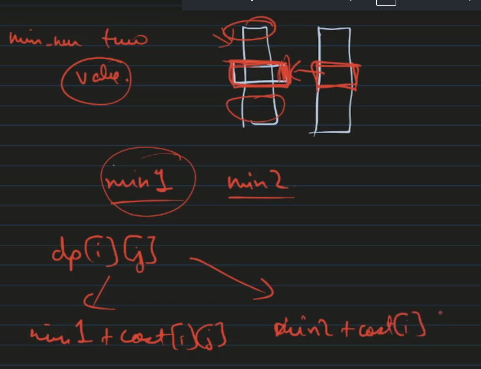
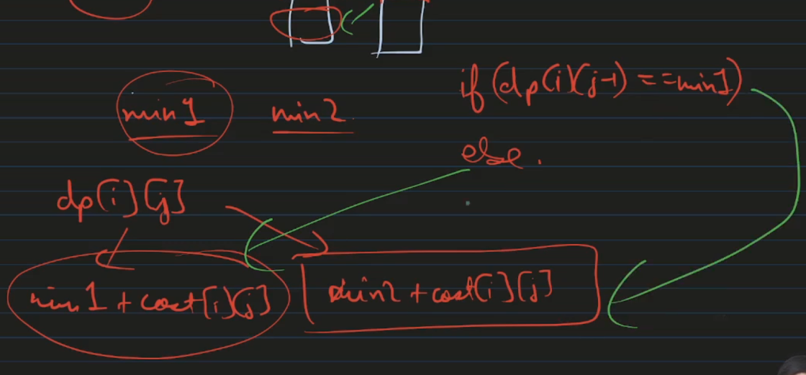

```cpp
int minCostII(vector<vector<int>>& ma) {
    int n=ma.size();        
    int colors=ma[0].size();
    vector<vector<int>> dp(n+1,vector<int>(colors,0));
    for(int i=1;i<=n;i++){
        for(int j=0;j<colors;j++){
            dp[i][j]=INT_MAX;
            for(int k=0;k<colors;k++){
                if(k!=j) dp[i][j]=min(dp[i][j],dp[i-1][k]);
            }
            dp[i][j]+=ma[i-1][j];
        }
    }
    return *min_element(dp[n].begin(),dp[n].end());
}
```
Maintaing two minimum of the last column




# nk

# Memory optimization
